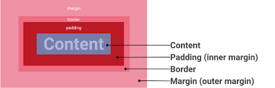

# **Unix Command Line**
ada beberapa perintah pada saat menggunakan windows, mac, dan linux :

| command | Description |
| ----------- | ----------- |
| ls | Untuk menampilkan daftar file dan folder |
| ls -la | Untuk menampilkan daftar file yang tersembunyi (hidden) |
| cd | Untuk pindah Directory |
| cd .. | Untuk pindah Directory awal |
| ni | Untuk membuat fle (Powerdhell dan CMD) |
| touch | Untuk membuat file (Linux dan Unix(MacOS)) |
| cp | Untuk menyalin file |
| mv | Untuk memindahkan file dan folder ke Directory baru |
| rm | Untuk menghapus file  |
| rm -r | Untuk menghapus folder    |
| mkdir | Untuk membuat folder baru |
| pwd | Untuk menampilkan Directory yang sedang aktif |

# **Git dan Github** #
> GIT adalah tools untuk melacak setiap perubahan file atau folder dari suatu file programmer.  GIT sebagai Version Control System (VCS). Secara garis besar GIT digunakan untuk mencatat setiap file termasuk code yang kita buat, selain itu perubahan tersebut dapat dilakukan secara individu maupun kelompok. GIT mampu melacak perubahan code maupun orang yang melakukan perubahan code tsb). Ada beberapa penyedia GIT, yaitu : Github, Gitlab dan Bitbucket. 
> Cara membuka GIT ada 3, yaitu:
1. Powershell
2. Command prompt (CMD)
3. Git bash

> Konfigurasi GIT ada 2, yaitu:
1. git config --global user.name “Umi uzli a”
2. git config --global user.email umi99kirei@gmail.com

| command | Description |
| ----------- | ----------- |
| git config --list | Untuk melihat hasil konfigurasi |
| git init | Untuk inisialisasi repository |
| git status | Untuk check file mengalami perubahan atau didalam proyek    |
| git remote | Untuk mendaftarkan repository yang telah dibuat pada github |
| git add | Untuk mendaftarkan suatu file perubahan ke step stage dalam suatu proyek. Contoh : git add index.html  |
| git add . | Untuk mendaftarkan semua ke step stage  perubahan file dalam suatu proyek |
| git commit -m "pesan comit"| Untuk menyimpan perubahan ke dalam version control |
| git push | Untuk mengirimkan ke version control (github) |

# **HTML** #
 ## (Hypertext Markup Language)
> Html tersusun dari sebuah kerangka dalam sebuah website.
> Dasar-dasar HTML dapat di definisakan sebagai ekstansi file (.html dan .htm). struktur-struktur pada HTML :

| Syntax | Description |
| ----------- | ----------- |
| !DOCTYPE html |  menyatakan bahwa dokumen ini adalah documen html |
| head | struktur utama html. head berisi beberapa element : title, meta dan link |
| body | struktur utama html. body berisi beberapa element : p, h1, img, dan vidio |
### Anatomi HTML
> Html memiliki opening tag `
`  dan closing tag `
` yang disertai dengan isi suatu html, dimana keseluruhan tersebut dapat dikatakan sebagai element. Pada html terdapat atribut yang dapat menampilkan gambar (src (source)) serta terdapat ` ` untuk membuat baris baru, dimana br tidak memiliki closing tag.
> Semantic html untuk membuat prrogram lebih tertata. Semantik itu sendiri dapat mempermudah programmer dengan programmer lainnya. dalam `<body>` terdapat beberapa semantic, yaitu:
`<article>`, `<aside>`, `
`, `<figcaption>`, `<figure>`, `<footer>`,        `<header>`, `<main>`, `<mark>`, `<nav>`, `<section>`, `
`, dan `<time>`. terdapat juga Deploy pada HTML. Deploy html adalah sebuah proses untuk menyebarkan aplikasi yang sudah kita kerjakan supaya bisa digunakan oleh orang-orang. cara mendeploy server yaitu menggunakan netify.com.
# **CSS** #  
## (Cascading style sheets)
> CSS adalah bahasa yang digunakan untuk mendesain halaman website agar terlihat menarik saat dilihat.
> struktur CSS diawali dengan selektor yang berisi property yang memiliki value di dalamnya menggunakan breket pembuka dan breket penutup.
ada tiga cara menggunakan CSS, yaitu:
1. Inline style
    > penulisan property CSS langsung di dalam teks HTML. penulisammya dilakukan pada 
2. Internal style
    > menggunakan tag style di dalam head. misalkan `<style> .teks-warma-merah { color : red }`
3. Eksternal CSS
    > Pembuatan file CSS terpisah dengan HTML. secara eksternal CSS harus dipanggil terlebih dahulu menggunakan property CSS dan memberi atribut bertype stylesheet pada teks HTML. Misalnya `<link href="stylr CSS" type"teks/CSS" rel="stylesheet">`
> 
>Note : pada CSS terdapat atribut class dan id didalam element. ID dimana  satu element hanya memuat satu ID sedangkan class bisa digunakan pada beberapa element. 

### Box-system
> Beberapa bagian dari Box-system : 
1. Border : merupakan batas suatu elemen
2. Margin : merupakan ruang disekitar batas elemen.
3. Padding : merupakan ruang atara batas elemen dan konten elemen.
> 
### Flexbox
> adalah cara untuk mengatur tata letak (layout) secara otomatis.  
# **ALGORITMA DAN PSEUDOCODE**
## Algoritma 
> adalah deskripsi berupa step-step yang dibutuhkan untuk meyelesaikan suatu masalah. penyelesaian masalah suatu algoritma yaitu berasal dari sekumpulan data. kualitas suatu algoritma, yaitu:
> menentukan input, output dan tidak mengandung suatu code pemerograman tertentu.

## Pseudocode
> adalah menuliskan algoritma dengan umumnya bahasa inggris sebelum diimplementasikan ke dalam bahasa pemerograman. cara menulskan pseudocode : menggunakan huruf besar pada kata kunci (Contoh: IF, THEN dll), satu statment = 1 baris, menggunakan indentasi, menggunakan bahasa yang spesifik, dan simpel.
Macam-macam Pseudocode
 :
 1. Prosedural
    > algoritma prosedural merupakan cara berpikir runut. artinya sekumpulan perintah atau sebuah perintah yang berurutan.
    contoh :
    - STORE "width" with any value
    - STORE "height" with any value
    - STORE "area" without any value
    - 
    - CALCULATE "width" times "height"
    - SET "area" value with calculation result
    - DISPLAY "area"
 2. Conditional
    > digunakan saat dibutuhkan percabangan kasus. komputer akan melakukan suatu tindakan jika suatu kondisi terpenuhi.  Contoh :
    - STORE "score" to any number
    - IF "score" < 70
    -   DO "learn more"
    - ELSE
    -   DO "reward myself"
    - DO "continue with life..."

 3. Looping
    > adalah sebuah proses yang dilakukan secara berulang-ulang.
 4. Recursive
    > adalah pola pikir dalam algoritma yang memanggil fungsi-metode ke dalam sebuah fungsi.